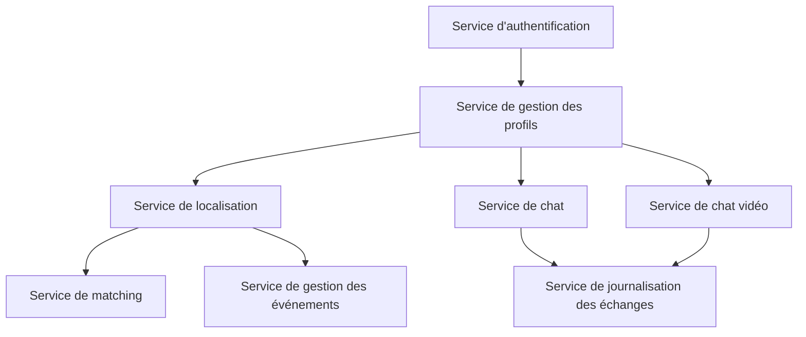
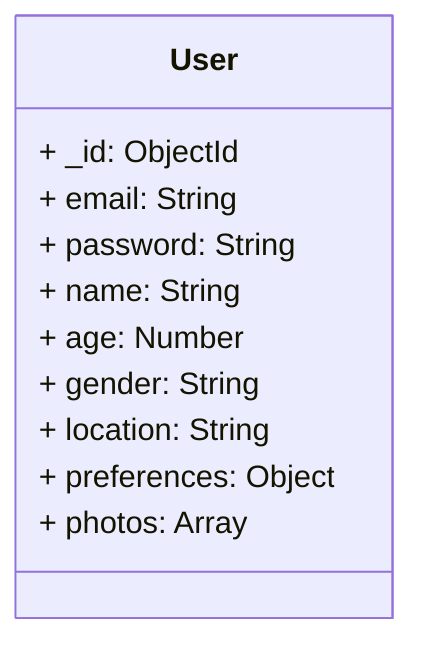
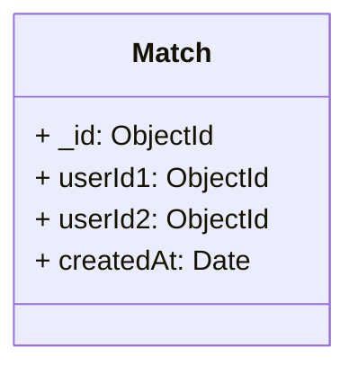
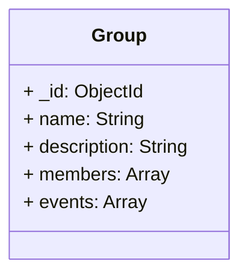
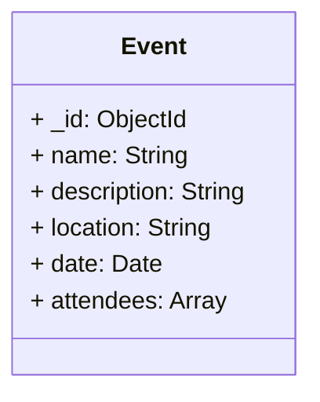
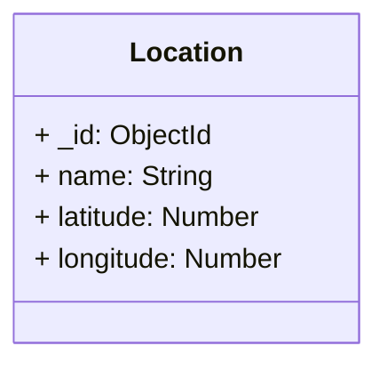

# Application de Rencontre

Cette application de rencontre permet aux utilisateurs de matcher avec d'autres personnes, de trouver des groupes pour sortir en soirée et de gérer les informations des utilisateurs, les événements dans la ville et la localisation.

## Fonctionnalités

- **Matching** : Les utilisateurs peuvent parcourir les profils des autres utilisateurs et décider de les matcher ou non, à la manière de Tinder.

- **Groupes de sortie** : Les utilisateurs peuvent trouver des groupes avec lesquels ils peuvent sortir en soirée ou participer à des événements spécifiques.

- **Gestion des utilisateurs** : L'application permet de gérer les informations des utilisateurs, telles que les profils, les préférences, les photos, etc.

- **Gestion des événements** : Les utilisateurs peuvent consulter les événements dans leur ville, tels que des soirées, des expositions, etc., et y participer.

- **Localisation** : L'application utilise une carte pour permettre aux utilisateurs de se positionner sur une localisation différente et de rencontrer des personnes à cet endroit.

- **Service de chat entre utilisateurs** : Les utilisateurs peuvent communiquer entre eux via un service de chat intégré à l'application.

- **Service de chat par vidéos** : Les utilisateurs peuvent également avoir des conversations en vidéo avec d'autres utilisateurs grâce à un service de chat par vidéos.

## Microservices

L'application utilise une architecture basée sur des microservices pour assurer la scalabilité et la flexibilité. Voici les principaux microservices utilisés :

1. **Service d'authentification** : Gère l'authentification des utilisateurs, la création de comptes, la connexion, etc.

2. **Service de gestion des profils** : Gère les profils des utilisateurs, les informations personnelles, les préférences, les photos, etc.

3. **Service de matching** : Gère l'algorithme de matching et les fonctionnalités associées.

4. **Service de gestion des événements** : Gère les événements dans la ville, les informations, les inscriptions, etc.

5. **Service de localisation** : Gère la fonctionnalité de localisation, la carte, les positions des utilisateurs, etc.

6. **Service de chat** : Gère le service de chat entre utilisateurs, permettant les conversations textuelles.

7. **Service de chat vidéo** : Gère le service de chat par vidéos, permettant les conversations en vidéo entre utilisateurs.

8. **Service de journalisation des échanges** : Gère la journalisation des échanges entre utilisateurs, conformément aux exigences de la RGPD.

Voici un exemple de schéma pour la base de données NoSQL de votre application de rencontre :

## Schéma de la base de données

La base de données NoSQL de l'application de rencontre est conçue pour stocker les informations des utilisateurs, les correspondances (matches), les groupes de sortie, les événements et les données de localisation. Voici un aperçu du schéma de la base de données :

### Collection "users"

La collection "users" contient les informations des utilisateurs enregistrés dans l'application.

Chaque document de la collection "users" contient les champs suivants :

- `_id` : l'identifiant unique de l'utilisateur (généré automatiquement par la base de données).
- `email` : l'adresse e-mail de l'utilisateur.
- `password` : le mot de passe de l'utilisateur (stocké de manière sécurisée en utilisant des algorithmes de chiffrement forts).
- `name` : le nom de l'utilisateur.
- `age` : l'âge de l'utilisateur.
- `gender` : le genre de l'utilisateur.
- `location` : la localisation de l'utilisateur.
- `preferences` : les préférences de l'utilisateur (par exemple, les préférences de recherche de partenaires).
- `photos` : les photos de l'utilisateur (stockées sous forme d'URL ou de références vers des fichiers).

### Collection "matches"

La collection "matches" contient les correspondances entre les utilisateurs.

Chaque document de la collection "matches" contient les champs suivants :

- `_id` : l'identifiant unique de la correspondance (généré automatiquement par la base de données).
- `userId1` : l'identifiant de l'utilisateur 1 dans la correspondance.
- `userId2` : l'identifiant de l'utilisateur 2 dans la correspondance.
- `createdAt` : la date et l'heure de création de la correspondance.

### Collection "groups"

La collection "groups" contient les informations sur les groupes de sortie.

Chaque document de la collection "groups" contient les champs suivants :

- `_id` : l'identifiant unique du groupe (généré automatiquement par la base de données).
- `name` : le nom du groupe.
- `description` : la description du groupe.
- `members` : les membres du groupe (stockés sous forme d'identifiants d'utilisateurs).
- `events` : les événements associés au groupe (stockés sous forme d'identifiants d'événements).

### Collection "events"

La collection "events" contient les informations sur les événements dans la ville.

Chaque document de la collection "events" contient les champs suivants :

- `_id` : l'identifiant unique de l'événement (généré automatiquement par la base de données).
- `name` : le nom de l'événement.
- `description` : la description de l'événement.
- `location` : la localisation de l'événement.
- `date` : la date et l'heure de l'événement.
- `attendees` : les participants à l'événement (stockés sous forme d'identifiants d'utilisateurs).

### Collection "locations"

La collection "locations" contient les informations sur les différentes localisations disponibles.

Chaque document de la collection "locations" contient les champs suivants :

- `_id` : l'identifiant unique de la localisation (généré automatiquement par la base de données).
- `name` : le nom de la localisation.
- `latitude` : la latitude de la localisation.
- `longitude` : la longitude de la localisation.

## Stratégies de sécurité

La sécurité des données et la protection de la plateforme sont des aspects essentiels de notre application de rencontre. Voici quelques stratégies de sécurité à mettre en place :

1. **Chiffrement des données** : Toutes les données sensibles, telles que les mots de passe des utilisateurs, doivent être stockées de manière sécurisée en utilisant des algorithmes de chiffrement forts.

2. **Authentification et autorisation** : Utilisez des mécanismes d'authentification robustes, tels que JWT (JSON Web Tokens), pour vérifier l'identité des utilisateurs et contrôler leur accès aux fonctionnalités de l'application.

3. **Protection contre les attaques par injection** : Utilisez des requêtes préparées ou des ORM (Object-Relational Mapping) pour éviter les attaques par injection SQL.

4. **Validation des entrées utilisateur** : Validez et filtrez toutes les entrées utilisateur pour prévenir les attaques XSS (Cross-Site Scripting) et autres vulnérabilités.

5. **Sécurité des API** : Utilisez des mécanismes d'authentification et de chiffrement pour sécuriser les API utilisées par les microservices.

6. **Surveillance et journalisation** : Mettez en place des outils de surveillance et de journalisation pour détecter les activités suspectes, les tentatives d'intrusion et les fuites de données.

7. **Respect de la RGPD** : Le service de journalisation des échanges doit être conçu de manière à respecter les exigences de la RGPD en matière de collecte, de stockage et de traitement des données personnelles.

## Optimisations

Voici quelques suggestions d'optimisations que vous pourriez envisager pour votre projet :

1. **Optimisation des requêtes de base de données** : Assurez-vous que vos requêtes de base de données sont optimisées pour éviter les goulots d'étranglement de performances. Par exemple, vous pourriez envisager d'utiliser des index pour accélérer les requêtes de recherche sur des champs spécifiques.

2. **Caching** : Vous pourriez envisager d'utiliser un système de mise en cache pour stocker les données fréquemment demandées et réduire la charge sur votre base de données. Redis est une option populaire pour cela.

3. **Load Balancing** : Si votre application reçoit beaucoup de trafic, vous pourriez envisager d'utiliser un équilibrage de charge pour répartir le trafic entre plusieurs serveurs et éviter que votre application ne soit surchargée.

4. **Auto-scaling** : En fonction de la charge de travail, vous pourriez envisager d'utiliser l'auto-scaling pour augmenter ou diminuer automatiquement le nombre de serveurs en fonction de la demande.

5. **Sécurité** : Continuez à mettre à jour et à renforcer vos stratégies de sécurité. Par exemple, vous pourriez envisager d'ajouter une protection contre les attaques DDoS ou d'utiliser un pare-feu d'application web (WAF).

6. **Tests de performance** : Effectuez régulièrement des tests de performance pour vous assurer que votre application peut gérer la charge de travail prévue.

7. **Intégration continue / Déploiement continu (CI/CD)** : Si ce n'est pas déjà fait, mettez en place un pipeline CI/CD pour automatiser le processus de test et de déploiement de votre application.

8. **Monitoring et alerting** : Mettez en place des outils de surveillance pour suivre les performances de votre application en temps réel et configurer des alertes pour être informé en cas de problèmes.

9. **Optimisation des images** : Si votre application permet aux utilisateurs de télécharger des photos, assurez-vous que ces images sont optimisées pour le web pour réduire le temps de chargement.

10. **Utilisation de CDN** : Pour améliorer les performances de votre application pour les utilisateurs du monde entier, vous pourriez envisager d'utiliser un réseau de distribution de contenu (CDN).

11. **Amélioration de l'expérience utilisateur** : Enfin, continuez à recueillir des commentaires des utilisateurs et à améliorer l'expérience utilisateur en fonction de ces commentaires.
