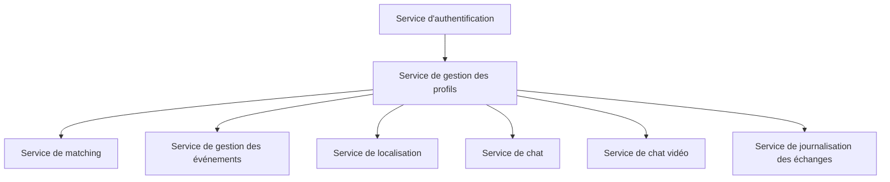

# Application de Rencontre

Cette application de rencontre permet aux utilisateurs de matcher avec d'autres personnes, de trouver des groupes pour sortir en soirée et de gérer les informations des utilisateurs, les événements dans la ville et la localisation.

## Fonctionnalités

- **Matching** : Les utilisateurs peuvent parcourir les profils des autres utilisateurs et décider de les matcher ou non, à la manière de Tinder.
- **Groupes de sortie** : Les utilisateurs peuvent trouver des groupes avec lesquels ils peuvent sortir en soirée ou participer à des événements spécifiques.
- **Gestion des utilisateurs** : L'application permet de gérer les informations des utilisateurs, telles que les profils, les préférences, les photos, etc.
- **Gestion des événements** : Les utilisateurs peuvent consulter les événements dans leur ville, tels que des soirées, des expositions, etc., et y participer.
- **Localisation** : L'application utilise une carte pour permettre aux utilisateurs de se positionner sur une localisation différente et de rencontrer des personnes à cet endroit.
- **Service de chat entre utilisateurs** : Les utilisateurs peuvent communiquer entre eux via un service de chat intégré à l'application.
- **Service de chat par vidéos** : Les utilisateurs peuvent également avoir des conversations en vidéo avec d'autres utilisateurs grâce à un service de chat par vidéos.

## Microservices

L'application utilise une architecture basée sur des microservices pour assurer la scalabilité et la flexibilité. Voici les principaux microservices utilisés :

1. **Service d'authentification** : Gère l'authentification des utilisateurs, la création de comptes, la connexion, etc.
2. **Service de gestion des profils** : Gère les profils des utilisateurs, les informations personnelles, les préférences, les photos, etc.
3. **Service de matching** : Gère l'algorithme de matching et les fonctionnalités associées.
4. **Service de gestion des événements** : Gère les événements dans la ville, les informations, les inscriptions, etc.
5. **Service de localisation** : Gère la fonctionnalité de localisation, la carte, les positions des utilisateurs, etc.
6. **Service de chat** : Gère le service de chat entre utilisateurs, permettant les conversations textuelles.
7. **Service de chat vidéo** : Gère le service de chat par vidéos, permettant les conversations en vidéo entre utilisateurs.
8. **Service de journalisation des échanges** : Gère la journalisation des échanges entre utilisateurs, conformément aux exigences de la RGPD.

## Stratégies de sécurité

La sécurité des données et la protection de la plateforme sont des aspects essentiels de notre application de rencontre. Voici quelques stratégies de sécurité à mettre en place :

1. **Chiffrement des données** : Toutes les données sensibles, telles que les mots de passe des utilisateurs, doivent être stockées de manière sécurisée en utilisant des algorithmes de chiffrement forts.
2. **Authentification et autorisation** : Utilisez des mécanismes d'authentification robustes, tels que JWT (JSON Web Tokens), pour vérifier l'identité des utilisateurs et contrôler leur accès aux fonctionnalités de l'application.
3. **Protection contre les attaques par injection** : Utilisez des requêtes préparées ou des ORM (Object-Relational Mapping) pour éviter les attaques par injection SQL.
4. **Validation des entrées utilisateur** : Validez et filtrez toutes les entrées utilisateur pour prévenir les attaques XSS (Cross-Site Scripting) et autres vulnérabilités.
5. **Sécurité des API** : Utilisez des mécanismes d'authentification et de chiffrement pour sécuriser les API utilisées par les microservices.
6. **Surveillance et journalisation** : Mettez en place des outils de surveillance et de journalisation pour détecter les activités suspectes, les tentatives d'intrusion et les fuites de données.
7. **Respect de la RGPD** : Le service de journalisation des échanges doit être conçu de manière à respecter les exigences de la RGPD en matière de collecte, de stockage et de traitement des données personnelles.
